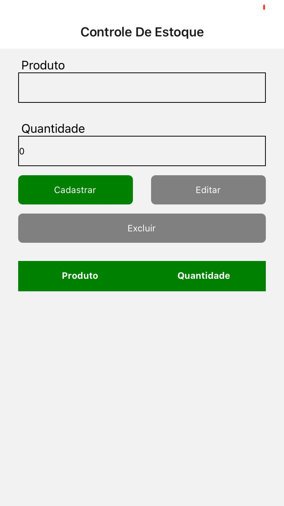
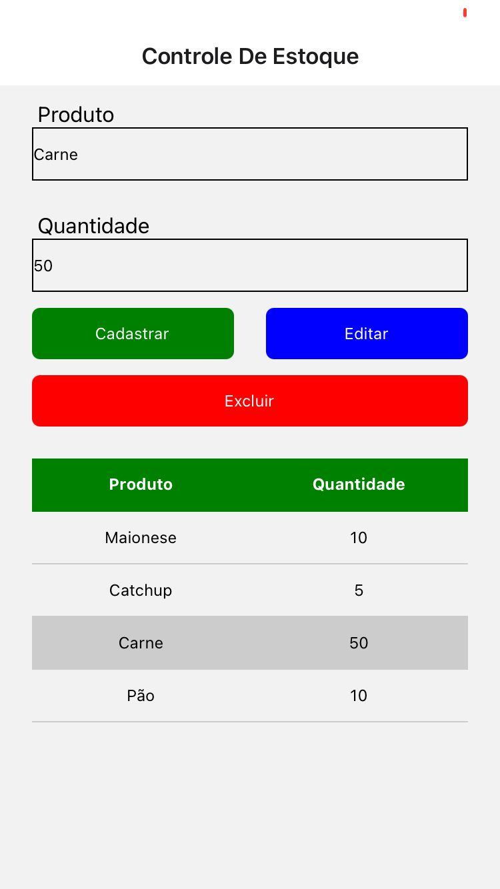

# Software de controle de estoque usando apenas React Native

- Projeto de controle de estoque para dispositivos móveis.
- Toda lógica de programação foi construida com a linguagem Javascript, o esqueleto básico foi construido com os componentes do React Native e os estilos foi criado usando a linguagem de estilos CSS.

## Para baixar e iniciar o projeto

1. Instale as dependências 

   ```bash
   npm install
   ```

2. Inicie o aplicativo 

   ```bash
    npx expo start
   ```
   
   
   